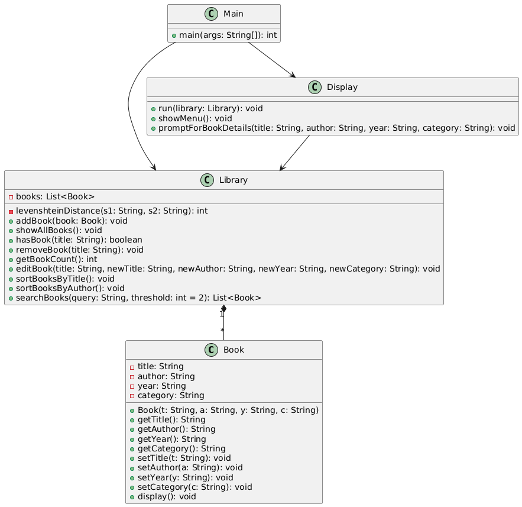

# 圖書館管理系統

##  小專題介紹
這是一個用於管理書籍的簡單系統，包含新增書籍、顯示書籍和搜尋書籍等基本功能。

## 小組資料 & 分工

- **系級班級**：資訊工程學系 1B  
- **組別**：第11組  
- **組長**：陳格洋  
- **組員**：李晶沛、梁宇宏  
- **程式碼**：陳格洋
- **簡報製作**：李晶沛
- **上台報告**：梁宇宏

##  功能說明

- **新增書籍** - 可以將新書籍加入圖書館。

- **顯示所有書籍** - 列出圖書館中的所有書籍。

- **搜尋書籍** - 根據書名搜尋特定書籍。

- **退出系統** - 結束程式執行。

## UML圖

## 程式介紹
### Book 類別 (Book.h / Book.cpp)
用於表示書籍，包含標題、作者、年份、分類等屬性，以及存取與顯示方法

屬性：

> string title – 書名

> string author – 作者

> string year – 出版年份

> string category – 分類

方法：

> Book(const string& t, const string& a, const string& y, const string& c) – 建構子

> string getTitle() const – 取得書名

> string getAuthor() const – 取得作者

> string getYear() const – 取得年份

> string getCategory() const – 取得分類

> void setTitle(const string& t) – 設定書名

> void setAuthor(const string& a) – 設定作者

> void setYear(const string& y) – 設定年份

> void setCategory(const string& c) – 設定分類

> void display() const – 顯示書籍完整資訊

### Library 類別 (Library.h / Library.cpp)
管理書籍集合，支援新增、顯示、判斷存在、刪除、修改、排序與模糊搜尋功能

屬性：

> vector<Book> books – 書籍列表

方法：

> void addBook(const Book& book) – 新增書籍

> void showAllBooks() const – 顯示所有書籍

> bool hasBook(const string& title) const – 判斷書籍是否存在

> void removeBook(const string& title) – 刪除指定書籍

> void editBook(const string& title, const string& newTitle, const string& newAuthor, const string& newYear, const string& newCategory) – 修改書籍資訊

> int getBookCount() const – 回傳書籍總數

> void sortBooksByTitle() – 按書名排序

> void sortBooksByAuthor() – 按作者排序

> vector<Book> searchBooks(const string& query, int threshold = 2) const – 模糊搜尋書籍（Levenshtein 距離 + 關鍵字匹配）

### Display 類別 (Display.h / Display.cpp)
負責與使用者互動，顯示選單並根據輸入呼叫 Library 的各項功能

方法：

> void run(Library& library) const – 執行主選單循環

> void showMenu() const – 顯示功能選單

> void promptForBookDetails(string& title, string& author, string& year, string& category) const – 提示並讀取書籍詳細資訊

### Main 程式 (Main.cpp)
程式進入點，負責建立 Library 與 Display 實例，並啟動使用者介面 Main

方法：

> int main() – 主函式，回傳程式執行結果。

## 運行畫面截圖

